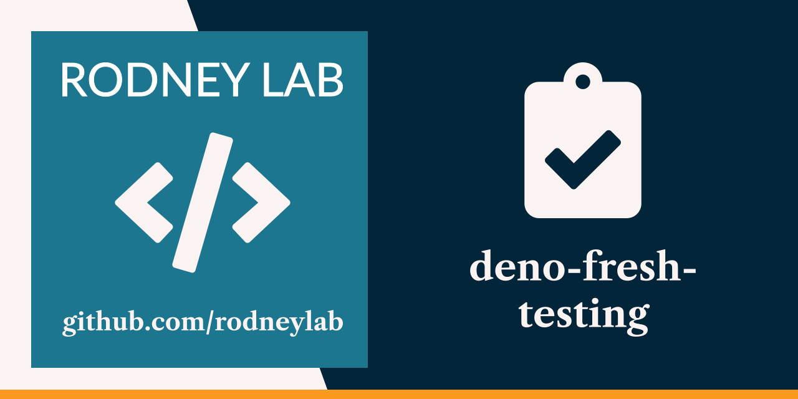

<p align="center">
  <a aria-label="Open Rodney Lab site" href="https://rodneylab.com" rel="nofollow noopener noreferrer">
    
  </a>
</p>
<h1 align="center">
  Deno Fresh Testing
</h1>

# deno-fresh-testing

[](https://stackblitz.com/github/rodneylab/deno/tree/main/demos/deno-fresh-testing)

Code from Rodney Lab
<a href="https://rodneylab.com/deno-fresh-testing/">Deno testing post where we
see how to set up end-to-end testing in your Deno Fresh project</a>. If you have
any questions, please drop a comment at the bottom of that page.

# Deno Fresh Testing

### Usage

Start the project:

```
deno task start
```

This will watch the project directory and restart as necessary.

Feel free to jump into the
[Rodney Lab matrix chat room](https://matrix.to/#/%23rodney:matrix.org).
