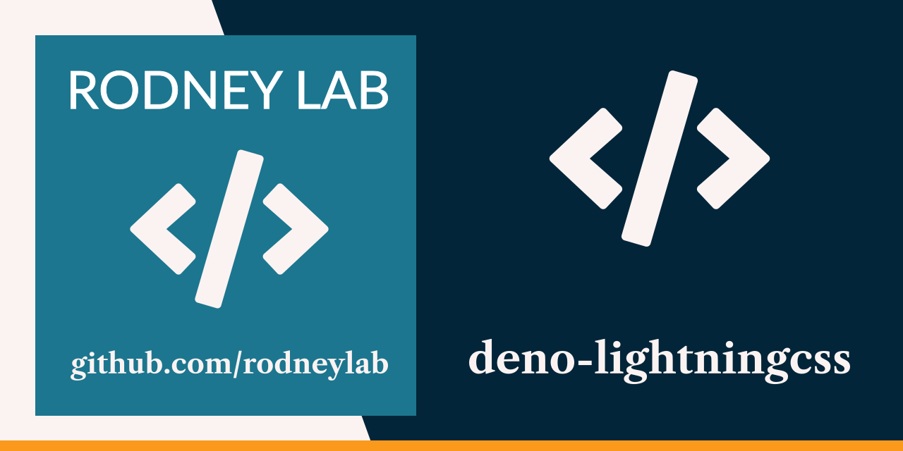

<p align="center">
  <a aria-label="Open Rodney Lab site" href="https://rodneylab.com" rel="nofollow noopener noreferrer">
    
  </a>
</p>
<h1 align="center">
  Deno Lightning CSS
</h1>

# deno-lightning-css

[](https://stackblitz.com/github/rodneylab/deno/tree/main/demos/deno-lightningcss)

Code from Rodney Lab
<a href="https://rodneylab.com/using-lightning-css-with-deno/">Deno Lightning
CSS video, where we see how you can create a watch script with Deno, esbuild and
Lightning CSS to bundle, transpile and minify your CSS</a> each time you hit
save on an input. If you have any questions, please drop a comment at the bottom
of that page.

# Deno Lightning CSS

### Usage

Start the project:

```
deno task start
```

This will watch the project directory and restart as necessary.

Feel free to jump into the
[Rodney Lab matrix chat room](https://matrix.to/#/%23rodney:matrix.org).
