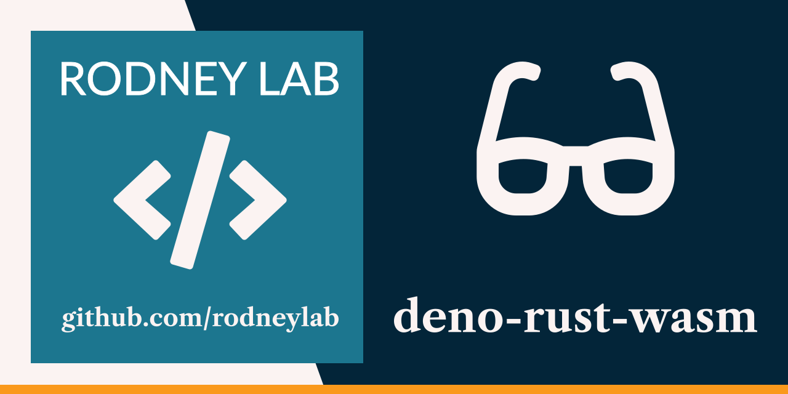

<p align="center">
  <a aria-label="Open Rodney Lab site" href="https://rodneylab.com" rel="nofollow noopener noreferrer">
    
  </a>
</p>
<h1 align="center">
  Deno Rust WASM
</h1>

# deno-rust-wasm

[](https://stackblitz.com/github/rodneylab/deno/demos/deno-rust-wasm)

Code from Rodney Lab
<a aria-label="Open Rodney Lab blog post on trying out Deno fresh" href="https://rodneylab.com/deno-fresh-wasm/">Deno Fresh WASM blog post</a> in which we generate Base64 image placeholders from files to learn how to use Rsut WASM with Deno. If you have any questions, please drop a comment
at the bottom of that page.

# Deno Rust WASM

### Usage

Start the project:

```shell
deno task start
```

Compile WASM:

```shell
deno task wasmbuild
```

This will watch the project directory and restart as necessary.

Feel free to jump into the
[Rodney Lab matrix chat room](https://matrix.to/#/%23rodney:matrix.org).
